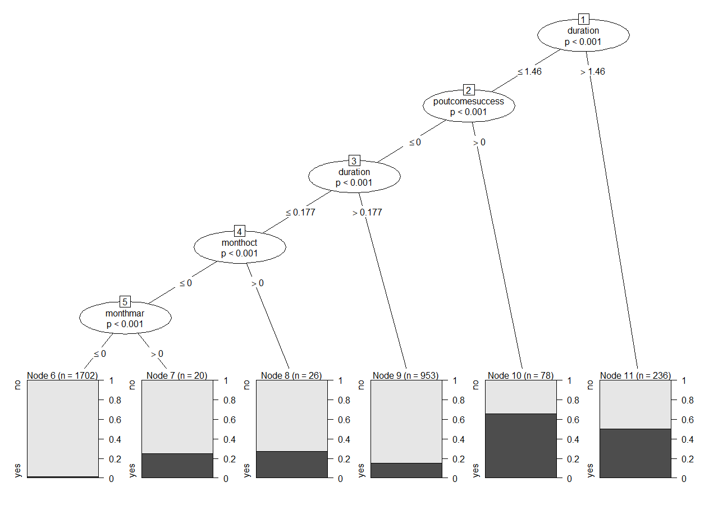

```{r setup, include=FALSE}
knitr::opts_chunk$set(echo = TRUE, warning = FALSE, message = FALSE)
```

## Cel projektu

Celem badania jest budowa optymalnego modelu klasyfikacyjnego za pomocą wybranych algorytmów uczenia maszynowego. Głównym zadaniem będzie zweryfikowanie na podstawie podanych predyktorów czy klient banku założy lokatę terminową.

## Opis zbioru badawczego 

Zbiór danych **Bank Marketing** pochodzi ze strony **UCI Machine Learning Repository**. Zawiera on informacje o 4522 klientach portugalskiego banku. Na podstawie 16 zmiennych u każdego z klientów określono fakt założenia lokaty terminowej (17 zmienna). Dane są związane przede wszystkim z kampanią marketingu bezpośredniego wspomnianej instytucji. 

**Wszystkie informacje odnośnie wykorzystywanych zmiennych są przedstawione poniżej.**

**Zmienne:**

1. **age** (wiek klienta) – zmienna numeryczna

2. **job** (zawód klienta) – zmienna jakościowa, przyjmuje 12 poziomów: 
a) admin (administrator) 
b) technician (technik) 
c) blue-collar (pracownik fizyczny) 
d) hausemaid (pokojówka) 
e) management (kierownik) 
f) entrepreneur (przedsiębiorca) 
g) services (usługi) 
h) self-employed (samozatrudniony) 
i) retired (emeryt) 
j) student (student) 
k) unemployed (bezrobotny) 
l) unknown (nieznany) 

3. **marital** (stan cywilny klienta) – zmienna jakościowa, przyjmuje 4 poziomy:
a) married (żonaty) 
b) divorced (rozwiedziony, owdowiały) 
c) single (wolny) 
d) unknown (nieznany) 

4. **education** (wykształcenie klienta) – zmienna jakościowa, przyjmuje 4 
poziomy:
a) tertiary (wyższe) 
b) secondary (średnie) 
c) primary (podstawowe) 
d) unknown (nieznany)

5. **default** (czy występuje niespłacony kredyt u klienta) – zmienna binarna, 
przyjmuje dwie wartości: yes, no.

6. **balance** (przeciętny stan konta klienta podany w euro) – zmienna 
numeryczna.

7. **housing** (czy występuje kredyt mieszkaniowy u klienta) – zmienna 
binarna, przyjmuje dwie wartości: yes, no.

8. **loan** (czy klient posiada zaciągniętą pożyczkę) – zmienna binarna, 
przyjmuje dwie wartości: yes, no.

9. **contact** (typ komunikacji banku z klientem) – zmienna jakościowa, 
przyjmuje 3 poziomy:
a) telephone (telefoniczna) 
b) cellular (komórkowa) 
c) unknown (nieznana)

10. **day** (numer dnia w miesiącu, w którym występował poprzedni kontakt 
banku z klientem) – zmienna numeryczna.

11. **month** (miesiąc, w którym występował poprzedni kontakt banku 
z klientem) - zmienna jakościowa, przyjmuje 12 poziomów.

12. **duration** (czas trwania ostatniego kontakt banku z klientem, podany 
w sekundach) – zmienna numeryczna.

* Jeżeli duration=0 (brak kontaktu), to y automatycznie przyjmuje „no”. Zatem 
takie obserwacje nie będą uwzględniane.

13. **campaign** (liczba kontaktów banku z klientem podczas obecnej kampanii 
marketingowej) – zmienna numeryczna.

14. **pdays** (liczba dni, które minęły od ostatniego kontaktu banku z klientem 
podczas trwania poprzedniej kampanii) – zmienna numeryczna 

* -1 oznacza, że podczas poprzedniej kampanii bank nie kontaktował się 
z danym klientem.

15. **previous** (liczba kontaktów banku z klientem, które zostały wykonane 
przed obecną kampanią marketingową) – zmienna numeryczna.

16. **poutcome** (rezultat poprzedniej kampanii marketingowej – za sukces 
rozumiemy założenie lokaty) – zmienna jakościowa, przyjmuje 4 poziomy:
a) success (sukces) 
b) failure (porażka) 
c) other (inna) 
d) unknown (nieznana)

17. **y** (informuje czy klient za sprawą obecnej kampanii marketingowej 
założył lokatę terminową w banku) – zmienna binarna, przyjmuje dwie 
wartości: yes, no. **Jest to zmienna zależna w naszym badaniu.**

**Podsumowanie zmiennych w zbiorze danych Bank Marketing**

```{r,echo=FALSE}
library(tidyverse)
library(readr)
bank_marketing <- read.csv(file = "bank_marketing.csv", header = TRUE, sep = ";")
braki_danych <- sum(is.na(bank_marketing))
duration_0 <- sum(bank_marketing$duration==0)
summary(bank_marketing)
bank_marketing$y <- as.factor(bank_marketing$y)
```

## Analiza zbioru badawczego oraz przygotowanie danych

Zbiór danych **Bank Marketing** nie posiada braków danych. Dodatkowo nie występują obserwacje, gdzie zmienna `duration` przyjmuje wartość 0. W przypadku występowania takich obserwacji należałoby je usunąć. Posiadamy zatem kompletny zbiór danych do rozpoczęcia badań.

Sprawdzimy teraz czy w naszym zbiorze danych nie występują zmienne stałe oraz czy nie będzie konieczna standaryzacja zmiennych numerycznych w celu uzyskania optymalnych modeli klasyfikacyjnych.

W celu dokładnego uporządkowania zbioru danych wykorzystamy funkcję `preProcess` pakietu `caret`. Sprawdzi ona, które z naszych zmiennych należałoby standaryzować, usunać (zmienne stałe) lub dokonać normalizacji rozkładu (transformacja YeoJohnsona).

```{r,echo=FALSE}
library(AppliedPredictiveModeling)
library(caret)
clean_data <- preProcess(bank_marketing, method = c("center","scale","YeoJohnson","nzv"))
```

**Otrzymujemy następujące wyniki:**

1. Standaryzować należy zmienne: `age`, `balance`, `day`, `duration`, `campaign`, `previous`.

2. Transformacja `YeoJohnsona` zostanie przeprowadzona dla zmiennych: `age`, `balance`, `day`, `duration`, `campaign`.

3. Zmienne stałe to: `pdays` (tutaj przeważa wartość -1, czyli bank nie kontaktował się z klientem podczas ostatniej kampanii marketingowej).

Oto kilka wierszy naszego zbioru danych po przeprowadzeniu wspomnianych operacji.

```{r, echo=FALSE}
bank_marketing <- predict(clean_data, newdata = bank_marketing)
head(bank_marketing)
```

**Dzielimy teraz zbiór danych na zbiór uczący i zbiór treningowy.**

W zbiorze uczącym znajdzie się 2/3 wszystkich obserwacji, natomiast w zbiorze testowym 1/3 wszystkich obserwacji.

Wartości przyjmowane przez zmienną wynikową pozostaną mniej więcej w takiej samej proporcji w zbiorze uczącym i zbiorze testowym. Zatem około 11% wartości zmiennej wynikowej `y` będzie przyjmowało wartość  `yes`.

```{r,echo=FALSE}
set.seed(2020)
podzial_zbioru <- createDataPartition(bank_marketing$y, p = 2/3)
data.learn <- bank_marketing[podzial_zbioru$Resample1,]
data.test <- bank_marketing[-podzial_zbioru$Resample1,]
```

**Przeprowadzimy również kroswalidację na zbiorze uczącym (kroswalidacja 10-krotna).**

```{r,echo=FALSE}
set.seed(2020)
control <- trainControl(method = "cv", number = 10)
control_2 <- trainControl(method = "cv", number = 5, classProbs = T, summaryFunction = twoClassSummary, savePredictions = T)
```

## Metody wykorzystywane w projekcie 

**Metody:**

* **Proste drzewo decyzyjne typu CART**

* **Drzewo decyzyjne Ctree**

* **Las losowy**

* **Boosting**

* **LDA**

* **Regresja logistyczna**

* **Metoda k najbliższych sąsiadów**

* **Naiwny klasyfikator Bayesa**

**Dokładność klasyfikacji każdej z metod zostanie sprawdzona zarówno dla ustawionych parametrów domyślnych jak również tych wybranych niezależnie przez autora projektu.**

**Na końcu pracy wszystkie wykorzystane metody zostaną porównane ze względu na uzyskaną skuteczność klasyfikacyjną.**

### Proste drzewo decyzyjne typu CART

**Drzewo decyzyjne** jest strukturą hierarchiczną przedstawiającą model klasyfikacyjny lub regresyjny. Drzewa decyzyjne stosowane są przede wszystkim, gdy funkcyjna postać związku pomiędzy predyktorami a zmienną wynikową jest nieznana lub ciężka do ustalenia.

Każde drzewo decyzyjne składa się z **korzenia (ang. root)**, **węzłów (ang. nodes)** i **liści (ang. leaves)**. Korzeniem nazywamy początkowy węzeł drzewa, z którego poprzez **podziały (ang. splits)** powstają kolejne węzły potomne. Końcowe węzły, które nie podlegają podziałom nazywamy liśćmi, a linie łączące węzły nazywamy **gałęziami (ang. branches)**.

Jeśli drzewo służy do zadań klasyfikacyjnych, to liście zawierają informację o tym, która klasa w danym ciągu podziałów jest najbardziej prawdopodobna. Natomiast, jeśli drzewo jest regresyjne, to liście zawierają warunkowe miary tendencji centralnej (najczęściej średnią) wartości zmiennej wynikowej. **Warunek stanowi szereg podziałów doprowadzający do danego węzła terminalnego (liścia)**. Drzewo “dąży” do takiego podziału by kolejne węzły, a co za tym idzie również liście, były jak najbardziej jednorodne ze względu na zmienną wynikową.

Budując drzewo decyzyjne ustawiamy `tuneLength = 10`. Pozwoli to na wyświetlenie 10 propozycji różnych drzew o podanym parametrze `cp` (określa złożoność drzewa) oraz miarach dopasowania modelu (`Accuracy` i `Kappa`). 

```{r,echo=FALSE}
library(rpart)
library(rpart.plot)
set.seed(2020)
drzewo.rpart <- train(y~., data = data.learn, method = "rpart", trControl = control, tuneLength = 10)
drzewo.rpart
```

**Wybieramy sugerowany model i rysujemy odpowiadające mu drzewo.**

```{r,echo=FALSE}
rpart.plot(drzewo.rpart$finalModel)
```

**Otrzymujemy dosyć prosty model o wysokiej skuteczności (klasyfikacja na zbiorze uczącym)**

Wybierzemy teraz kilka innych wartości `cp` i sprawdzimy jak wpłynie to na klasyfikacje.

```{r,echo=FALSE}
rpart.grid <- expand.grid(cp = seq(0.0001,0.03,length.out = 10))
drzewo.rpart_2 <- train(y~., data = data.learn, method = "rpart", trControl = control, tuneGrid = rpart.grid)
drzewo.rpart_2
```

Wraz ze wzrostem złożoności naszego drzewa decyzyjnego nie występuje znacząca poprawa w klasyfikacji. 

Otrzymujemy podobny wynik jak dla pierwszego modelu. Optymalne rozwiązanie dla drzewa o współczynniku `cp = 0.02335556`.

**Dokonamy teraz predykcji dla obu model na zbiorze testowym i ocenimy ich faktyczną skuteczność.**

**Predykcja dla modelu o domyślnych współczynnikach z `cp = 0.02586207`.**

```{r,echo=FALSE}
set.seed(2020)
predykcja_1 <- predict(drzewo.rpart, newdata = data.test)
confusionMatrix(predykcja_1, data.test$y, positive = "yes")
```

Skuteczność modelu na zbiorze testowym okazuje się jeszcze lepsza niż na zbiorze uczącym. Poprawnie zostaje zaklasyfikowane około 90% wszystkich obserwacji.

**Predykcja dla modelu o wybranych współczynnikach z `cp = 0.02335556`.**

```{r,echo=FALSE}
set.seed(2020)
predykcja_2 <- predict(drzewo.rpart_2, newdata = data.test)
confusionMatrix(predykcja_2, data.test$y, positive = "yes")
```

**Wyniki są niemal identyczne. Dla obu model otrzymujemy skuteczność w przybliżeniu na poziomie 90%.**

**Jakość predykcji na podstawie drzewa decyzyjnego CART okazała się bardzo dobra.** 

### Drzewo Ctree

Wykorzystamy teraz inny algorytm budowy drzewa decyzyjnego, mianowicie **Ctree**.

Główną różnicą w stosunku do drzew typu **CART** jest sposób budowy podziałów, oparty na teście niezależności $\chi^2$ Pearsona. Wyboru reguły podziału dokonuje się poprzez testowanie niezależności zmiennej niezależnej z predyktorami. Reguła o największej wartości statystyki $\chi^2$ jest stosowana w pierwszej kolejności. 

```{r,echo=FALSE}
set.seed(2020)
drzewo.ctree <- train(y~., data = data.learn, method = "ctree", trControl = control, tuneLength = 10)
drzewo.ctree
```

Domyślnym parametrem jest `mincriterion`. Najprościej mówiąc jeżeli `mincriterion = 0.99`, to `p.value - p` musi być mniejsze od `0.01`(test $\chi^2$ Pearsona), aby podzielić węzeł nadrzędny na kolejne węzły podrzędne. Im większa wartość parametru, tym trudniej jest rodzielać drzewo decyzyjne na kolejne węzły. 

Wybieramy optymalny model dla `mincriterion = 0.5544444`. Rysowanie tego drzewa nie ma sensu, ponieważ jest to bardzo złożony model przez co staje się mało czytelny.

Wykorzystamy `mincriterion = 0.99999999`, podczas budowy nowego modelu. Pozwoli to jak najlepiej zobrazować nasze drzewo decyzyjne.

```{r,echo=FALSE}
set.seed(2020)
ctree_grid <- expand.grid(mincriterion=0.99999999)
drzewo.ctree_2 <- train(y~., data = data.learn, method = "ctree", trControl = control, tuneGrid = ctree_grid)
drzewo.ctree_2
```

Pomimo bardzo dużej różnicy w wartości parametru, to otrzymujemy praktycznie identyczną skuteczność na zbiorze uczącym. 

Poniżej przedstawiony jest rysunek prostszego drzewa.

```{r,echo=FALSE}
#plot(drzewo.ctree_2$finalModel)
```



**Testujemy teraz wyniki predykcji na zbiorze testowym odpowiednio 1 i 2 modelu.**

```{r,echo=FALSE}
set.seed(2020)
predykcja_3 <- predict(drzewo.ctree, newdata = data.test)
confusionMatrix(predykcja_3, data.test$y, positive = "yes")
predykcja_4 <- predict(drzewo.ctree_2, newdata = data.test)
confusionMatrix(predykcja_4, data.test$y, positive = "yes")
```

**Dokładność predykcji dla modelu bardziej złożonego wyniosła w przybliżeniu `90%`. Natomiast drugi o wiele prostszy model przewidywał poprawnie wartości zmiennej wynikowej z prawdopodobieństwem `89%`. Wyniki są bardzo dobre. Optymalniejszym modelem wydaje się model drugi, ponieważ pomimo swojej prostoty nie tracił skuteczności podczas predykcji.**

## Las losowy

Jeżeli pojedyńcze drzewo decyzyjne charakteryzuje się dużą wariancją i nie daje oczekiwanych rezultatów, to można wykorzystać zbiór takich drzew połączonych w pewien sposób. Tak powstały metody: **random forest**,**bagging**,**boosting**.

**Metoda lasów losowych (random forest)** polega na losowaniu dla każdego drzewa wchodzącego w skład lasu **m** predyktorów spośród **p** dostępnych, a następnie budowaniu drzew z wykorzystaniem tylko tych predyktorów. Dzięki temu za każdym razem drzewo jest konstruuowane w oparciu o nowy zestaw cech. Otrzymane predykcje nie są wtedy, aż tak skorelowane. Pozwala to na uzyskanie większej liczby informacji, co przekłada się na lepsze wyniki końcowego modelu.

```{r,echo=FALSE}
set.seed(2020)
mod.las <- train(y~., data = data.learn, method = "rf", trControl = control, tuneLength = 10)
mod.las
```

Otrzymujemy optymalne rozwiązanie dla **23** predyktorów. **Jeżeli zmienna jest typu jakościowego, to każdy poziom takiej zmiennej jest traktowany jako predyktor.** Możemy zauważyć, że różnica pomiędzy`Accuracy` w drzewach wykorzystujących 6 zmiennych i 41 zmiennych jest bardzo mała, dlatego nie będziemy budowali drugiego modelu. Poniżej znajduje się podsumowanie naszego wybranego modelu.

```{r,echo=FALSE}
mod.las$finalModel
```

**Sprawdzamy skuteczność modelu na zbiorze testowym.**

```{r,echo=FALSE}
set.seed(2020)
predykcja_5 <- predict(mod.las, newdata = data.test)
confusionMatrix(predykcja_5, data.test$y, positive = "yes")
```

**Otrzymujemy kolejny raz skuteczność predykcji na poziomie `90%`.**

## Boosting

W metodzie **Boosting** nie wykorzystujemy za każdym razem tych samych predyktorów do budowy drzewa. **Nie stosuje się tu również prób bootstrapowych**. Algorytm prezentuje się następująco: 1 drzewo uczy się zmienności zmiennej wyjściowej **y**, kolejne drzewo uczy się zmienności **y-r**, gdzie **r** jest to zbiór informacji uzyskanych w 1 kroku. Postępowanie powtarza się do momentu wyczerpania liczby drzew w modelu.

```{r,include=FALSE}
set.seed(2020)
library(gbm)
mod.boosting <- train(y~., data = data.learn, method = "gbm", trControl = control, tuneLength = 5)
```

```{r,echo=FALSE}
mod.boosting
```

Otrzmujemy finalny model z około `90%` skutecznością na zbiorze uczącym.

Podane zostaną teraz inne parametry: `n.trees = c(500,1000)`, `interaction.depth = 2:6`, `shrinkage = 0.05`, `n.minobsinnode = 25`. 

`n.trees` to liczba wykorzystwanych drzew w modelu

`interaction.depth` to maksymalna głębokość drzew

`shrinkage` - to szybkość uczenia

`n.minobsinnode` - to minimalna liczba obserwacji w węźle

```{r,include=FALSE}
boosting_grid <- expand.grid(n.trees = c(500,1000),interaction.depth = 2:6,shrinkage = 0.05,n.minobsinnode = 25)
mod.boosting_2 <- train(y~., data = data.learn, method = "gbm", trControl = control, tuneGrid = boosting_grid)
```

```{r,echo=FALSE}
mod.boosting_2
```

Pomimo wykorzystania większej liczby drzew nie otrzymujemy poprawy w jakości modelu. Dokładność predykcji na zbiorze uczącym jest minimalnie mniejsza. Dokonujemy zatem predykcji na zbiorze testowym wykorzystując zbudowane modele.

**Model z wartościami domyślnymi**

```{r,echo=FALSE}
set.seed(2020)
predykcja_6 <- predict(mod.boosting, newdata = data.test)
confusionMatrix(predykcja_6, data.test$y, positive = "yes")
```

Dokładność wynosi około `90%`.

**Model z ustawionymi parametrami.**

```{r,echo=FALSE}
set.seed(2020)
predykcja_7 <- predict(mod.boosting_2, newdata = data.test)
confusionMatrix(predykcja_7, data.test$y, positive = "yes")
```

Wynik jest minimalnie gorszy, jednak w przybliżeniu to dalej `90%`.

Rysunek przedstawiający wzrost dokładności modelu wraz z rosnącą liczbą drzew oraz ich większą głębokością.

```{r,echo=FALSE}
ggplot(mod.boosting)
```

**Różnice są bardzo małe, zatem należałoby wybrać najmniej rozbudowany model.**

## Model LDA - analiza dyskryminacji liniowej

**Liniowa analiza dyskryminacyjna** i związany z nią liniowy **dyskryminator Fishera** są używanie w uczeniu maszynowym do znalezienia liniowej kombinacji cech, które najlepiej rozróżniają dwie lub więcej klas obiektów lub zdarzeń. Wynikowe kombinacje są używane jako klasyfikator liniowy lub służą redukcji wymiarów do późniejszej klasyfikacji statystycznej. 

Budujemy model LDA. W tej metodzie nie występują parametry domyślne.

```{r,echo=FALSE}
library(MASS)
set.seed(2020)
mod.lda <- train(y~., data = data.learn, method = "lda", trControl = control)
mod.lda
```

**Na zbiorze uczącym `Accuracy` wynosi w przybliżeniu `89%`. Przechodzimy do predykcji na zbiorze testowym.**

```{r,echo=FALSE}
set.seed(2020)
predykcja_8 <- predict(mod.lda, newdata = data.test)
confusionMatrix(predykcja_8, data.test$y, positive = "yes")
```

**Na zbiorze testowym otrzymujemy nieco lepsze reultaty, mianowicie skuteczność na poziomie 90%.**

## Regresja Logistyczna

**Regresja logistyczna** jest techniką z rodziny klasyfikatorów liniowych z reprezentacją logistyczną, a formalnie należy do rodziny uogólnionych modeli liniowych **(GLM)**. Stosowana jest wówczas, gdy zmienna wynikowa posiada dwa stany (sukces i porażka), kodowane najczęściej za pomocą 1 i 0. W tej metodzie modelowane jest warunkowe prawdopodobieństwo sukcesu za pomocą kombinacji liniowej predyktorów X.

```{r,echo=FALSE}
set.seed(2020)
mod.logistyczna <- train(y~., data = data.test, method = "glm", trControl = control)
mod.logistyczna
```

Otrzymujemy skuteczność na poziomie `90%` na zbiorze uczącym. Poniżej prezentuje się podsumowanie naszego modelu.

```{r,echo=FALSE}
summary(mod.logistyczna$finalModel)
```

**Predykcja dla modelu regresji logistycznej.**

```{r,echo=FALSE}
set.seed(2020)
predykcja_9 <- predict(mod.logistyczna, data.test, type = "prob")
pred_class <- as.factor(ifelse(predykcja_9[,2]>0.5,"yes","no"))
confusionMatrix(pred_class, data.test$y, positive = "yes")
```

Skuteczność predykcji na zbiorze testowym wynosi `91%`.

## Metoda k najbliższych sąsiadów

**Technika k najbliższych sąsiadów** przewiduje wartość zmiennej wynikowej na podstawie **k** najbliższych obserwacji zbioru uczącego. Metoda nie posiada jawnej formy. Niech $x_0$ będzie obserwacją, dla której poszukujemy wartości zmiennej wynikowej $y_0$. Na podstawie zbioru obserwacji $x\in{T}$ zbioru uczącego wyznacza się **k** najbliższych sąsiadów, gdzie **k** jest z góry ustaloną wartością. Następnie, jeśli zadanie ma charakter klasyfikacyjny, to $y_0$ przypisuje się modę zmiennej wynikowej obserwacji będących **k** najbliższymi sąsiadami. W przypadku zadań regresyjnych $y_0$ przypisuje się średnią lub medianę.  

```{r,echo=FALSE}
set.seed(2020)
mod.knn <- train(y~., data = data.learn, method = "knn", trControl = control, tuneLength = 10)
mod.knn
```

Dla **k=5** otrzymujemy najlepszą skuteczność modelu na zbiorze uczącym. Sprawdzamy wyniki na zbiorze testowym.

```{r,echo=FALSE}
set.seed(2020)
predykcja_10 <- predict(mod.knn, data.test, type = "prob")
pred_class_2 <- as.factor(ifelse(predykcja_10[,2]>0.5,"yes","no"))
confusionMatrix(pred_class_2, data.test$y, positive = "yes")
```

**Ostatecznie metoda pozwala na uzyskanie skuteczności predykcji na poziomie w przybliżeniu`89%`.**

## Naiwny klasyfikator Bayesa

**Naiwny klasyfikator Bayesa** to prosty klasyfikator probabilistyczny. **Naiwne klasyfikatory bayesowskie są oparte na założeniu o wzajemnej niezależności predyktorów**. Często nie mają one żadnego związku z rzeczywistością i właśnie z tego powodu nazywa się je naiwnymi. Model prawdopodobieństwa można wyprowadzić korzystając z twierdzenia Bayesa. 

Poniżej przedstawione jest podsumowanie wyników dla zbioru uczącego.

```{r,echo=FALSE}
set.seed(2020)
library(klaR)
library(e1071)
xTrain <- data.learn[,-16]
yTrain <- data.learn$y
xTest <- data.test[,-16]
yTest <- data.test$y
mod.bayes <- train(xTrain,yTrain,"nb",trControl = control)
mod.bayes
```

Przechodzimy do właściwej predykcji na zbiorze testowym.

```{r,echo=FALSE}
set.seed(2020)
predykcja_bayes <- predict(mod.bayes$finalModel,xTest)$class
confusionMatrix(predykcja_bayes,yTest, positive = "yes")
```

**Dla naiwnego klasyfikatora Bayesa otrzymujemy skuteczność na poziomie `89%`.**

## Podsumowanie wyników zbudowanych modeli

Wszystkie nasze zbudowane modele dosyć dobrze poradziły sobie z postawionym zadaniem klasyfikacyjnym. `Accuracy` każdego modelu oscylowało w granicach `90%`. Jedynym problemem wydaje się niska wartość **Sensitivity (jak dobrze klasyfikujemy stan "yes")** dla każdej wykorzystanej metody. Wartość **Specificity (jak dobrze klasyfikujemy stan "no")** przyjmowała wartości bliskie 1, co świadczy o bardzo dobrej klasyfikacji. Przyczyną jest prawdopodobnie fakt, że w naszym zbiorze danych **Bank Marketing** zmienna wynikowa **y** przyjmowała stan **yes** tylko dla około `10%` przypadków i był to niewystarczający zbiór uczący.

**Porównamy teraz wszystkie metody oraz ich wyniki.**

```{r,echo=FALSE}
porownanie <- resamples(list(Drzewo_Cart = drzewo.rpart, Drzewo_Ctree = drzewo.ctree, Las_losowy = mod.las, Boosting = mod.boosting,
                             LDA = mod.lda, Regresja_log = mod.logistyczna, KNN = mod.knn, Bayes = mod.bayes))
summary(porownanie)
```

Poniżej znajdują się wykresy porównujące wyniki zbudowanych modeli.

```{r,echo=FALSE}
bwplot(porownanie)
```

Patrząc na wartości `Accuracy` i `Kappa` możemy powiedzieć, że *Regresja logistyczna*, *Las losowy* oraz *Boosting* najlepiej poradziły sobie z zadaniem klasyfikacyjnym. Chociaż wyniki wspomnianych metod są jedynie minimalnie lepsze.

Poniżej przedstawiony zostanie rysunek wskazujący istotne różnice pomiędzy wykorzystanymi modelami klasyfikacyjnymi.

```{r,echo=FALSE}
roznice <- diff(porownanie)
dotplot(roznice)
```

Istotne różnice otrzymujemy jednie w dwóch przypadkach, mianowicie **Las_losowy - Bayes** i **Boosting - Bayes**.

**Biorąc pod uwagę wszystkie zależności i miary dopasowania optymalnym rozwiązaniem byłoby wykorzystanie lasu losowego lub metody boosting w przedstawionym zadaniu klasyfikacyjnym.**